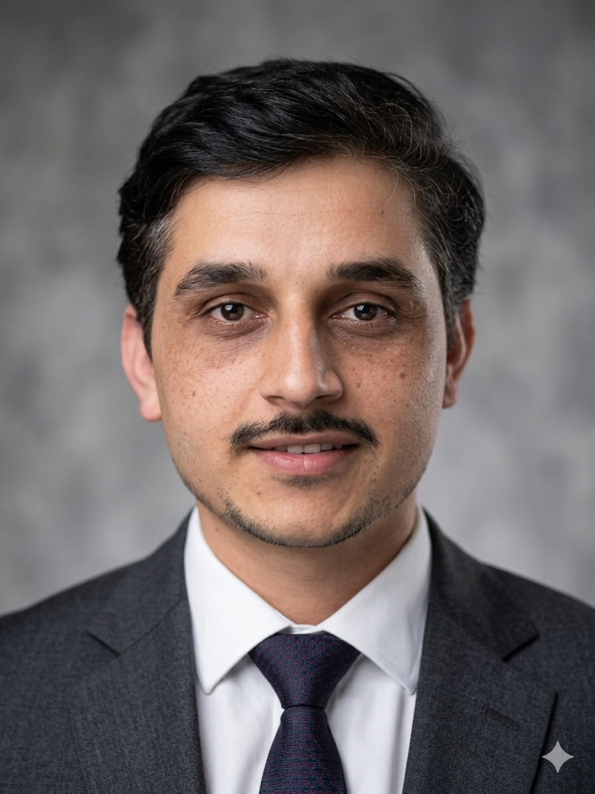

---

layout: default

title: "Home"

---

# Welcome

I am currently a Postdoctoral Fellow in the Department of Chemistry at The University of Texas at Austin, working with <a href="https://scholar.google.com/citations?hl=en&user=sNiAY9IAAAAJ&view_op=list_works&sortby=pubdate">Prof. Dave Thirumalai</a>. My research combines polymer physics, computational modeling, and biophysics to understand chromosome organization and mechanics.

I earned my Ph.D. (Dr. rer. nat.) from <a href="https://www.mpip-mainz.mpg.de/">Max Planck Institute for Polymer Research</a> in Mainz, Germany, under the supervision of <a href="https://scholar.google.com/citations?hl=en&user=4EGKVD0AAAAJ">Prof. Kurt Kremer</a>. My doctoral work focused on polymer brushes, spanning their growth mechanisms to their applications in nanoparticle organization. During this project, I closely collaborated with the experimental group of <a href="https://scholar.google.co.in/citations?user=f9cEXPkAAAAJ&hl=en">Prof. Regine von Klitzing</a> (co-supervisor) at the Technical University of Darmstadt.

